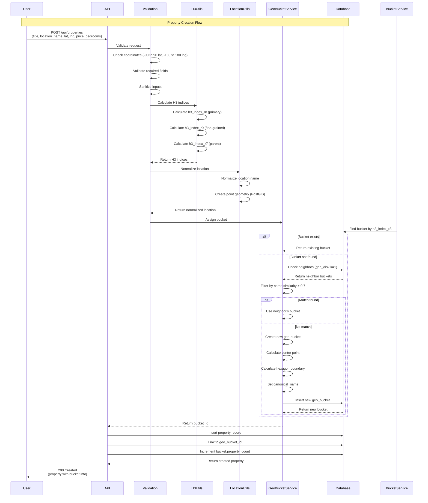
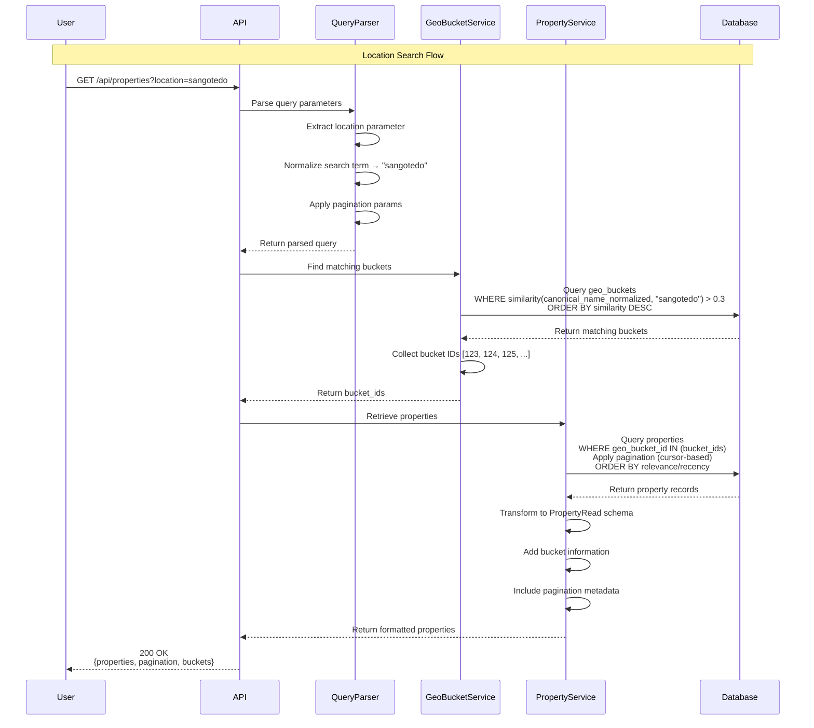
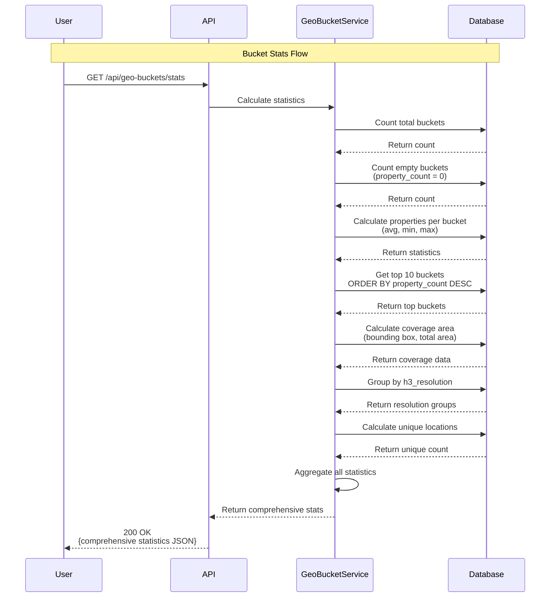

# Expert Listing Geo-Bucket System Design

## Problem Statement

Users searching for properties in the same geographic area experience inconsistent results due to variations in location names and coordinates. For example:

- **Search: "Sangotedo"** → 0 properties found
- **Search: "Sangotedo"** (different spelling/variation) → 47 properties found

This inconsistency arises from:

1. Properties having slightly different coordinates for the same neighborhood
2. Variations in location name spelling and formatting
3. Lack of a unified location grouping mechanism

**Goal:** Build a location normalization system using geo-buckets that groups nearby properties and provides consistent, typo-tolerant search results.

---

## Geo-Bucket Strategy

### H3 Hierarchical Spatial Index

This system uses **H3**, Uber's hexagonal hierarchical geospatial indexing system, as the primary geo-bucketing mechanism.

#### Why H3?

1. **Uniform Coverage**: Hexagons provide consistent area coverage without distortion
2. **Efficient Neighbor Finding**: Hexagons share edges (unlike geohash which only touches corners)
3. **Hierarchical Structure**: 16 resolutions (0-15) allow zoom from continent to meter-level precision
4. **Battle-Tested**: Used by Uber for billions of location queries
5. **Better Edge Cases**: No seam issues at boundaries like geohash suffers

#### Resolution Strategy

I used a **multi-resolution approach**:

- **Resolution 7** (Parent): ~5.2 km² per hexagon - Used for parent grouping
- **Resolution 8** (Primary): ~0.74 km² per hexagon - Primary bucket level (~860m edge)
- **Resolution 9** (Fine): ~0.10 km² per hexagon - Property-level precision

**Why Resolution 8?**

- Balances granularity with efficiency
- A neighborhood like Sangotedo fits within 1-3 hexagons
- Allows efficient neighbor lookup (7 hexagons including center)
- Prevents over-fragmentation while maintaining accuracy

#### Bucket Definition

```python
# Each property generates multiple H3 indexes
property = {
    "lat": 6.4698,
    "lng": 3.6285,
    "h3_index_r8": "881f1b4a9ffffff",  # Primary bucket
    "h3_index_r9": "891f1b4a93fffff",  # Fine-grained location
}

# Geo-bucket represents a geographic area
geo_bucket = {
    "h3_index": "881f1b4a9ffffff",     # Resolution 8 hexagon
    "parent_h3": "871f1b49fffffff",    # Resolution 7 parent
    "canonical_name": "Sangotedo",     # Most common name
    "property_count": 47,
    "center_point": "POINT(3.6285 6.4698)",
}
```

---

## Database Schema

### Tables and Relationships

```sql
-- Geo-Buckets: Geographic grouping of properties
CREATE TABLE geo_buckets (
    id BIGSERIAL PRIMARY KEY,
    h3_index BIGINT NOT NULL UNIQUE,           -- H3 index at resolution 8
    h3_resolution SMALLINT DEFAULT 8,
    canonical_name VARCHAR(255) NOT NULL,       -- Representative location name
    canonical_name_normalized TEXT,             -- Lowercased, trimmed for fuzzy match
    center_point GEOMETRY(POINT, 4326),         -- Hexagon center
    hexagon_boundary GEOMETRY(POLYGON, 4326),   -- Hexagon boundary
    parent_h3 BIGINT,                           -- Parent H3 at resolution 7
    property_count INTEGER DEFAULT 0,
    created_at TIMESTAMP DEFAULT NOW(),
    updated_at TIMESTAMP DEFAULT NOW()
);

-- Properties: Individual listings
CREATE TABLE properties (
    id BIGSERIAL PRIMARY KEY,
    title TEXT NOT NULL,
    location_name VARCHAR(255) NOT NULL,
    location_name_normalized TEXT,              -- For fuzzy matching
    coordinates GEOMETRY(POINT, 4326) NOT NULL,
    h3_index_r8 BIGINT NOT NULL,               -- H3 at resolution 8
    h3_index_r9 BIGINT NOT NULL,               -- H3 at resolution 9
    geo_bucket_id BIGINT REFERENCES geo_buckets(id),
    attributes JSONB,                           -- price, bedrooms, etc.
    created_at TIMESTAMP DEFAULT NOW(),
    updated_at TIMESTAMP DEFAULT NOW()
);
```

### Key Indexes

```sql
-- Indexes for fast lookups
CREATE INDEX idx_geo_buckets_h3_index ON geo_buckets(h3_index);
CREATE INDEX idx_geo_buckets_parent_h3 ON geo_buckets(parent_h3);

-- Property H3 indexes
CREATE INDEX idx_properties_h3_r8 ON properties(h3_index_r8);
CREATE INDEX idx_properties_h3_r9 ON properties(h3_index_r9);
CREATE INDEX idx_properties_geo_bucket ON properties(geo_bucket_id);

-- Fuzzy name matching with pg_trgm (trigram indexes)
CREATE EXTENSION IF NOT EXISTS pg_trgm;
CREATE INDEX idx_geo_buckets_name_trgm ON geo_buckets 
    USING gin(canonical_name_normalized gin_trgm_ops);
CREATE INDEX idx_properties_name_trgm ON properties 
    USING gin(location_name_normalized gin_trgm_ops);

-- Spatial indexes for PostGIS
CREATE INDEX idx_geo_buckets_center ON geo_buckets 
    USING gist(center_point);
CREATE INDEX idx_properties_coordinates ON properties 
    USING gist(coordinates);
```

## Location Matching Logic

I came up with a hybrid Approach that uses H3 Spatial indexing and  Fuzzy Text Matching to handle location variations.

### 1. Spatial Matching (Primary)

When a property is created:

```python
# Calculate H3 indexes at multiple resolutions
h3_r8 = h3.latlng_to_cell(lat, lng, resolution=8)  # Primary bucket
h3_r9 = h3.latlng_to_cell(lat, lng, resolution=9)  # Fine-grained
h3_r7 = h3.cell_to_parent(h3_r8, resolution=7)     # Parent for grouping

# Find or create geo-bucket
neighbors = h3.grid_disk(h3_r8, k=1)  # Get 7 hexagons (center + 6 neighbors)
```

**Bucket Assignment Logic:**

1. Check if exact H3 bucket exists
2. If not, check neighboring hexagons with similar names (similarity > 0.7)
3. If no match, create new bucket with this H3 index

### 2. Fuzzy Text Matching (Secondary)

Normalizes location names to handle variations:

```python
def normalize_location(name: str) -> str:
    """
    Sangotedo → sangotedo
    Sangotedo, Ajah → sangotedo ajah
    SANGOTEDO Lagos → sangotedo lagos
    """
    return name.lower().strip()
```

**PostgreSQL trigram similarity:**

```sql
-- Find buckets with similar names
SELECT * FROM geo_buckets
WHERE similarity(canonical_name_normalized, 'sangotedo') > 0.3
ORDER BY similarity(canonical_name_normalized, 'sangotedo') DESC;
```

### 3. Search Strategy

When user searches for `?location=sangotedo`:

```text
Step 1: Normalize search term → "sangotedo"

Step 2: Fuzzy name match on geo_buckets
  ↓
  Find buckets where similarity(canonical_name_normalized, "sangotedo") > 0.3
  ↓
  Returns: ["Sangotedo", "Sangotedo, Ajah", "sangotedo lagos"]

Step 3: Collect all bucket IDs → [123, 124, 125]

Step 4: Query properties
  ↓
  SELECT * FROM properties WHERE geo_bucket_id IN (123, 124, 125)
  ↓
  Returns all properties in matched buckets
```

### Similarity Thresholds

- **Exact H3 match**: Same hexagon → Same bucket
- **Neighbor + name similarity > 0.7**: Merge into existing bucket
- **Search fuzzy threshold > 0.3**: Include bucket in search results

## System Flow

### Property Creation Flow



### Location Search Flow



### Bucket Stats Flow



## Tech Stack

I used the following technologies:

- **FastAPI**: I used FastAPI for its async capabilities and easy to setup
- **SQLModel**: ORM combining SQLAlchemy and Pydantic for type-safe database operations
- **Pydantic**: Data validation and serialization
- **PostgreSQL 18+**: Primary data store
- **PostGIS**: Spatial database extension for geometry operations
- **pg_trgm**: Trigram extension for fuzzy text matching
- **H3-py**: Python bindings for Uber's H3 hexagonal grid system
- **GeoAlchemy2**: SQLAlchemy extensions for spatial types

## Design Decisions & Trade-offs

### 1. H3 vs Geohash

**Decision**: I used H3 hexagonal grid mechanism over geohash.

**Reasoning**:

- **Uniform coverage**: Hexagons minimize distance distortion
- **Better neighbors**: 6 direct neighbors vs geohash's 8 (with corner-only touching)
- **No seam issues**: Geohash has discontinuities at certain boundaries
- **Industry proven**: Used by Uber for ride matching at scale

**Trade-off**: Slightly more complex than geohash, but better accuracy justifies it

### 2. Multi-Resolution H3 Strategy

**Decision**: Store R7, R8, R9 indexes

**Reasoning**:

- R8 for primary buckets (neighborhood-level grouping)
- R9 for fine-grained property location
- R7 for hierarchical parent grouping

**Trade-off**: More storage (3x integers per property) but enables flexible querying

### 3. Hybrid Matching (H3 + Fuzzy Text)

**Decision**: Combine spatial and textual matching

**Reasoning**:

- H3 handles coordinate proximity
- Trigram similarity handles name variations/typos
- Weighted scoring provides best results

**Trade-off**: More complex queries but significantly better user experience

### 4. Bucket Creation Strategy

**Decision**: Auto-create buckets on property insertion

**Reasoning**:

- No pre-computation needed
- Scales naturally with property additions
- Buckets emerge organically from data

**Trade-off**: Requires neighbor checking on each insert (mitigated by indexing)

### 5. Canonical Name Selection

**Decision**: Use first property's location name as canonical

**Reasoning**:

- Simple implementation
- Can be updated later with most common name
- Future: Use ML to select best representative name

**Trade-off**: May not be the most intuitive name initially

### 6. Cursor-Based Pagination

**Decision**: Use cursor pagination instead of offset/limit

**Reasoning**:

- Avoids performance degradation on large datasets
- Consistent results even with concurrent writes
- Better performance for large datasets
- Prevents duplicate/missing items

**Trade-off**: Slightly more complex implementation

---

## Scalability Considerations

With the current System implementation, I believe the system should be able up to 100K properties before degrading. As such scaling to 500K+ Properties would require the following optimizations.

### Database Optimizations

1. **Partitioning**:

   ```sql
   -- Partition properties by H3 parent (resolution 7)
   CREATE TABLE properties (
       ...
       parent_h3 BIGINT
   ) PARTITION BY HASH (parent_h3);
   ```

2. **Materialized Views**:

   ```sql
   -- Pre-compute bucket statistics
   CREATE MATERIALIZED VIEW bucket_stats AS
   SELECT geo_bucket_id, COUNT(*) as count
   FROM properties GROUP BY geo_bucket_id;
   ```

3. **Read Replicas**:
   - Route search queries to read replicas
   - Write operations to primary

### Caching Layer

1. **Redis for Hot Data**:
   - Cache frequent location searches
   - Cache bucket → property_ids mappings
   - TTL: 15-30 minutes

2. **Application-Level Cache**:
   - H3 neighbor calculations (static data)
   - Bucket metadata

### Search Optimization

1. **Elasticsearch/OpenSearch** (Future):
   - Full-text search for complex queries
   - Geospatial queries with bool filters
   - Aggregations for faceted search

2. **Query Optimization**:
   - Limit neighbor search radius (k=1 for R8)
   - Use covering indexes
   - Batch property inserts

### Monitoring & Performance

- **Key Metrics**:
  - Bucket fragmentation (properties per bucket distribution)
  - Cache hit rates
  - H3 calculation time

- **Alerts**:
  - Bucket count growth anomalies
  - High property_count in single bucket (>1000)

---

## Limitations & Future Improvements

### Current Limitations

1. **No Multi-City Support**:
   - Same location names in different cities may collide
   - **Fix**: Add city/region prefix to canonical names

2. **Static Resolution**:
   - Fixed at R8 for all areas
   - **Fix**: Dynamic resolution based on property density

3. **Simple Canonical Name**:
   - First property's name used as canonical
   - **Fix**: Use most frequent name or ML-based selection

4. **No Historical Tracking**:
   - Bucket merges/splits not tracked
   - **Fix**: Add bucket version history table

5. **Limited Search Features**:
   - No radius search, polygon search
   - **Fix**: Add distance-based queries, custom boundary filters

## Future Enhancements

### Advanced Search

```python
# Radius-based search
GET /api/properties/search?lat=6.4698&lng=3.6285&radius_km=5

# Or probably polygon boundary search
POST /api/properties/search
{
    "boundary": {
        "type": "Polygon",
        "coordinates": [[[lng1, lat1], [lng2, lat2], ...]]
    }
}
```

#### Dynamic Bucketing

- Auto-split buckets with >1000 properties
- Merge sparse buckets (property_count < 5)
- Adaptive resolution based on density

#### Machine Learning

- Learn from user search patterns
- Suggest location name corrections
- Predict property location quality
- Anomaly detection (misplaced properties)

## Security Considerations

1. **Input Validation**:
   - Coordinate bounds checking
   - SQL injection prevention (parameterized queries)

2. **Rate Limiting**:
   - Per-IP rate limits on search endpoints
   - Stricter limits on write endpoints

3. **Data Privacy**:
   - No PII in properties (for this assessment)
   - Future: Probably anonymize property owner data if any

---

## Conclusion

This geo-bucket system solves location normalization through a hybrid approach:

1. **H3 spatial indexing** provides efficient, consistent geographic grouping
2. **Fuzzy text matching** handles name variations and typos
3. **Hierarchical structure** allows flexible zoom levels
4. **PostgreSQL + PostGIS** provides robust spatial capabilities

I believe this design balances:

- **Simplicity**: Clear data model, straightforward implementation
- **Performance**: Indexed lookups, async I/O
- **Accuracy**: Hybrid matching minimizes false negatives
- **Scalability**: Clear path to handle 500K+ properties

**Key Innovation**: Using H3's hexagonal grid eliminates common geohash issues while providing superior neighbor finding and uniform coverage, making "Sangotedo" searches consistently return all relevant properties regardless of name variation.
